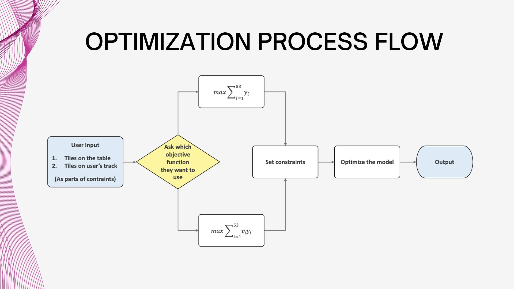

# Rummikub Solver: Addressing Rummikub Challenges with ILP

Team: Yu Lu, Jingwen He, Kelly Kao, Ge Gao, Yanhuan Huang

## Overview

Rummikub is a tile based game for 2 to 4 players, combining elements of the card game Rummy and Mahjong. The objective of this project is to win the game using Integer Linear Programming (ILP) to optimize the placement of tiles on the table by maximizing the number or value of tiles played. This solver aimed to enhance the gaming experience by uncovering hidden patterns, strategies, and statistical insights in the final hand of the game.

## Problem Description and Formulation

Rummikub is played with two sets of 52 tiles, each with numbers ranging from 1 to 13 in four different colors and two joker tiles. The goal is to be the first to empty the rack by forming groups and runs of matching numbers. To solve the final hand, we formulated two ILP models:

1. Maximizing Tiles Played: 
   Objective: Maximize the number of tiles played from the rack to the table. 
   Variables: Yi (times a tile is played) and Xj (times a set is played). 
   Constraints: The sets are formed only from tiles on the rack or table; number of times a tile could be placed on table is less than the number of times it would be on rack.
2. Maximizing Total Value: 
   Objective: Maximize the total value of tiles played. 
   Variables: Same as the first model, but each tile has a specific value (vi). 
   Constraints: Similar to the first model with the objective function adjusted for value.

## Probelm Exntensions

1. Four-Player Scenarios: 
   The current model can be extended for four-player scenarios, maintaining accuracy and predictive power. Further exploration into nuanced interactions is recommended.
2. Improved Joker Handling: 
   Introduce a two-step modeling approach to better handle jokers, ensuring more realistic outputs.
3. Time-Constrained Gameplay: 
   Consider time-based constraints to simulate real-time decision-making, enhancing strategic planning.
4. Player Behavior Patterns and Learning Algorithms: 
   Incorporate player behavior analysis and machine learning algorithms for a more dynamic and realistic gaming experience.

## Design Structure

## Libraries

- **Gurobi**
- **Matplotlib**
- **Numpy**

## Reference

Den Hertog, D., and P. B. Hulshof. “Solving Rummikub Problems by Integer Linear Programming.” The Computer Journal, vol. 49, no. 6, 1 Nov. 2006, pp. 665–669, https://doi.org/10.1093/comjnl/bxl033.​
